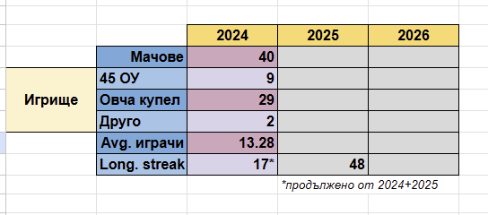

These requirements are after the first version of the app from football-wrapped-requirements.md

Things to improve

1. For each player we have only 3 "stories"/"slides" until we go to the final one. Make more for each player.
   Some of the new ones will include information about oour community in geenral. How many games have been played, on which field,
   our longest game streak in a row without missing a single saturday etc. I will provide that data here in the app.
   On the image I showed what type of additional data for the whole community. ON which field we played how many times, average plaeyrs per match (usually max 14), comparison between this and last year, longest streak, total games.
   

2. The data from the json is a little bit uneccesarry. players.json. For example we have the array dates2024,dates2025, games2024, games2025 and we dont need to calculate actually the total2024 and the total2025 and the totalAllTime in the json. Also some of the other are a bit uneccessary we can calculate them in the app. Like the rank can we calculated wirth some opearations. The goal is to leave in the json only the important information and everything else to be calculated in the app, not beforehand

3. Add a little bit more animations for each section. Maybe we can make some of the card to be like gifts wrapped and on click to reveal them like a chrisdmas present. Be original and make it interactive.
